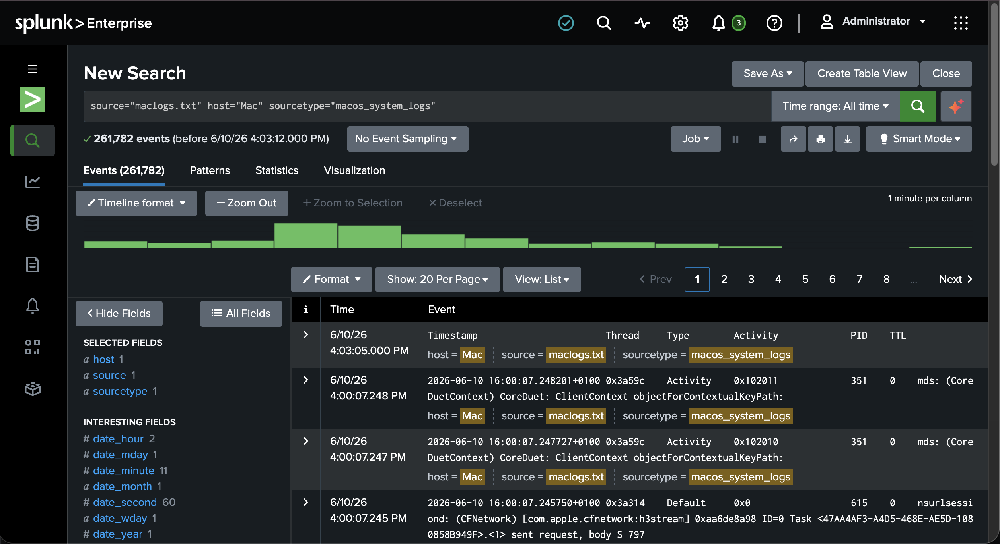
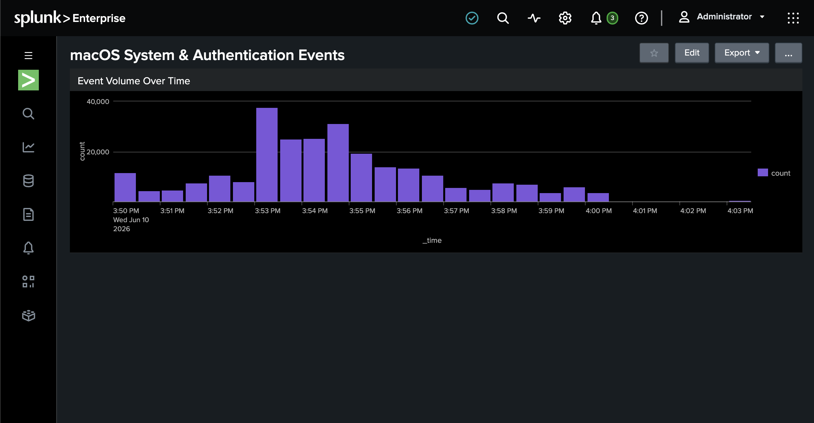
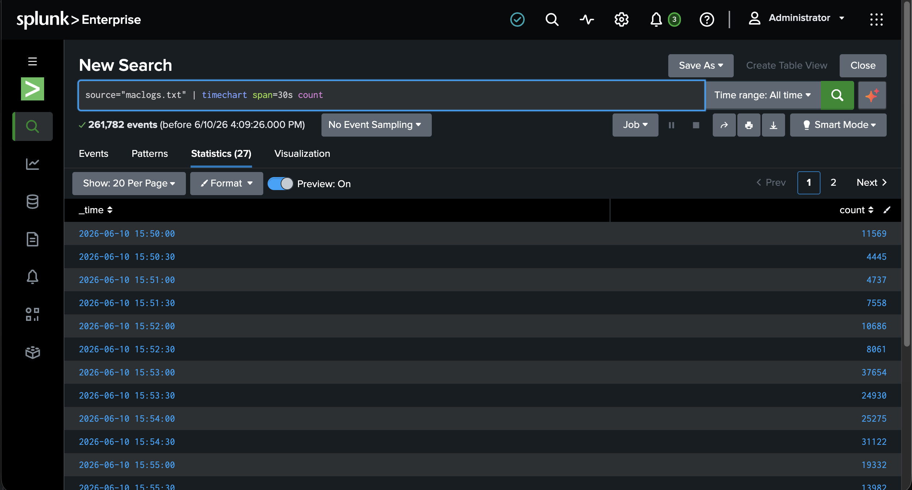

# SIEM Log Monitoring & Analysis Lab (Splunk Enterprise)

A hands-on home-lab project that builds an end-to-end log monitoring and analysis pipeline in **Splunk Enterprise**, replicating the core day-to-day workflow of a SOC (Security Operations Centre) analyst: **collect → monitor → detect → investigate**.

> Built as part of my MSc in Cybersecurity & Risk Management (University of Galway) to develop practical, tool-based SOC skills rather than theory alone.

---

## Overview

The goal of this lab was to stand up a working SIEM, get real log data flowing into it, and then use it the way an analyst would — building dashboards to monitor activity at a glance and using search queries to investigate specific events.

**What it does:**
- Ingests and indexes **macOS system logs** into Splunk Enterprise
- Provides **basic security monitoring** across authentication and system events
- Surfaces activity through **custom dashboards**
- Supports **ad-hoc investigation** using Splunk's Search Processing Language (SPL)

---

## Architecture

```
  macOS host (log source)
        │
        │  log files (/var/log/*, unified logs)
        ▼
  Splunk Enterprise  ──►  Index  ──►  Search & Reporting (SPL)
        │                              │
        ▼                              ▼
   Data Inputs                  Custom Dashboards
   (monitor / upload)        (auth + system events)
```

*Single-host lab: Splunk Enterprise running locally, ingesting logs from the same macOS machine.*

---

## What I Built

### 1. Log ingestion
- Installed and configured **Splunk Enterprise** locally.
- Set up **Data Inputs** to monitor and index macOS system logs.
- Verified events were parsed, timestamped, and searchable in the index.

### 2. Security monitoring
- Reviewed **authentication events** (logins, failed logins, privilege use) and general **system events**.
- Established a baseline of "normal" activity so unusual events stand out.

### 3. Custom dashboards
- Built dashboards to **visualise authentication and system events** — login activity, failed authentications, and event volume over time — for at-a-glance monitoring.

### 4. Investigation with SPL
- Used **Search & Reporting** to query, filter, and pivot through log data.
- Practised turning a vague question ("what happened around this time?") into a precise SPL search.

---

## Sample Searches (SPL)

> Index/sourcetype names below reflect this lab's setup

**Authentication failures over time**
```spl
index=macos ("authentication failed" OR "Failed to authenticate" OR "incorrect password")
| timechart count span=1h
```

**Privilege use (sudo) by user**
```spl
index=macos sudo
| stats count by user
| sort - count
```

**Event volume by source / process (spotting noisy or unusual sources)**
```spl
index=macos
| stats count by process
| sort - count
| head 20
```

**Activity in a specific time window during an investigation**
```spl
index=macos earliest="MM/DD/YYYY:HH:MM:SS" latest="MM/DD/YYYY:HH:MM:SS"
| table _time host process action user
| sort _time
```

---

## Screenshots

### Ingested macOS log events (261k+ events indexed)


### Event volume over time — dashboard


### Timechart analysis in Search & Reporting


---

## Skills Demonstrated

`Splunk Enterprise` · `SIEM` · `Log Ingestion` · `Log Analysis` · `SPL (Search Processing Language)` · `Security Monitoring` · `Dashboards` · `Incident Investigation`

---

## What I Learned

- How a SIEM actually fits together — from raw log source, to index, to a query you can act on.
- That the hard part isn't the tool; it's knowing **what "normal" looks like** so abnormal events stand out.
- How to translate an investigative question into an SPL query and narrow down to the relevant events.

---

## Roadmap / Next Iterations

These are planned improvements to make the lab map more closely to enterprise SOC environments:

- [ ] Add a **Windows + Sysmon** log source (most enterprise SOCs are Windows/Active Directory heavy)
- [ ] Write a **detection** for repeated failed logins / brute-force activity, with a saved search + alert
- [ ] Map detections to the **MITRE ATT&CK** framework
- [ ] Simulate a benign "attack" (e.g. multiple failed logins) and document the full investigation as a mock SOC ticket

---

## Author

**Abhinav Latpate** — MSc Cybersecurity & Risk Management, University of Galway
[LinkedIn](https://www.linkedin.com/in/abhinavlatpate-cybersecurity)
